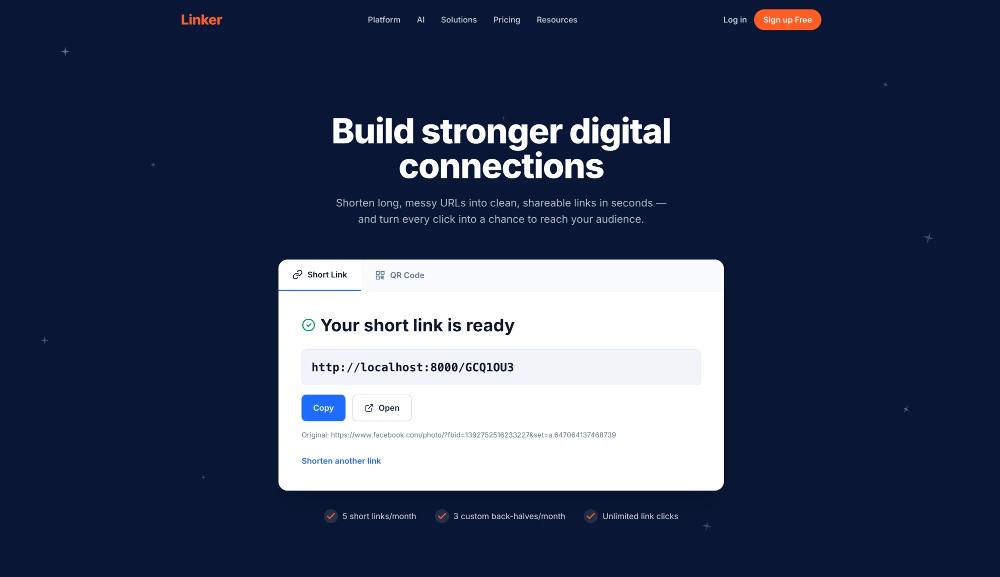

# Linker

A URL shortener built end-to-end as a portfolio project. Clean layered backend in Python, React frontend with a polished landing page, Postgres for persistence, Docker for reproducible local setup.

The goal isn't to compete with Bitly. It's to demonstrate sound architectural choices: dependency inversion, clean separation of layers, and a setup that scales from in-memory tests to a containerized stack without rewriting the core.



## Stack

**Backend**
- Python 3.13, FastAPI, Pydantic v2, pydantic-settings
- SQLAlchemy 2.0 (sync) with Alembic migrations
- Postgres 16 via psycopg
- Pytest for unit tests

**Frontend**
- Vite + React (JavaScript)
- Tailwind CSS
- No component library — components written from scratch

**Infrastructure**
- Docker + Docker Compose (app + Postgres with healthcheck)
- AWS deployment (ECS Fargate + RDS) — planned

## Architecture

The backend follows a clean layered design with dependency inversion via `typing.Protocol` (structural typing, not ABC). The domain layer is pure Python with zero infrastructure imports. The service depends only on the `UrlRepository` and `CodeGenerator` Protocols. The composition root in `app/api/dependencies.py` is the only file that knows about concrete implementations.

```
┌─────────────────┐
│  React Frontend │
└────────┬────────┘
         │ HTTP
         ▼
┌─────────────────────────────────────────────┐
│              FastAPI Controller             │
│  (translates HTTP ⇄ domain, no logic)       │
└────────┬────────────────────────────────────┘
         │
         ▼
┌─────────────────────────────────────────────┐
│              UrlService                     │
│  (business logic, retries on collision)     │
└────┬────────────────────────────────┬───────┘
     │                                │
     ▼                                ▼
┌──────────────────┐         ┌──────────────────┐
│ UrlRepository    │         │ CodeGenerator    │
│ (Protocol)       │         │ (Protocol)       │
└────────┬─────────┘         └────────┬─────────┘
         │                            │
   ┌─────┴─────┐                      ▼
   ▼           ▼                ┌──────────────┐
┌──────┐  ┌──────────┐          │ Random       │
│ Mem  │  │ Postgres │          │ (secrets)    │
└──────┘  └──────────┘          └──────────────┘
```

### Key design decisions

- **Domain entity is immutable.** `ShortUrl` is a `@dataclass(frozen=True)` with a timezone-aware `created_at` set by the service, not as a field default.
- **Concurrency via try-save-and-catch, not check-then-save.** The repository raises `CollisionError` on integrity violations; the service retries up to `max_retries`. The contract is identical for the in-memory and Postgres implementations.
- **Domain ≠ ORM.** `ShortUrl` (domain) and `UrlRecord` (SQLAlchemy ORM) are separate types. `PostgresUrlRepository._to_domain()` translates between them.
- **Strict in, lenient out.** The request schema uses Pydantic's `HttpUrl` for validation; the response uses plain `str`.
- **Secure code generation.** Uses `secrets` (not `random`) for cryptographically sound short codes.

## Project structure

```
linker/
├── python/
│   ├── app/
│   │   ├── domain/          # models.py, errors.py (pure Python)
│   │   ├── service/         # url_service.py, code_generator/
│   │   ├── repository/      # base.py (Protocol), in_memory.py, postgres/
│   │   ├── api/             # controller.py, schemas.py, dependencies.py
│   │   ├── config.py        # Settings via pydantic-settings
│   │   └── main.py          # FastAPI entrypoint + CORS
│   ├── tests/unit/          # 8 passing tests
│   ├── alembic/             # DB migrations
│   ├── Dockerfile
│   ├── docker-compose.yml
│   └── pyproject.toml
└── frontend/
    ├── src/
    │   ├── api/client.js    # fetch + error normalization
    │   └── components/      # Navbar, Hero, ShortenerCard, ResultView, ...
    ├── package.json
    └── vite.config.js
```

## Running locally

### Prerequisites
- Python 3.13
- Node.js 20+
- Docker Desktop

### Option A: Full stack via Docker Compose

```bash
cd python
docker compose up
```

The app comes up on `http://localhost:8000` with Postgres auto-migrated.

### Option B: Postgres in Docker, app + frontend locally (recommended for development)

**1. Start Postgres:**

```bash
cd python
docker compose up -d postgres
```

**2. Start the backend:**

```bash
cd python
source ../.venv/bin/activate
uvicorn app.main:app --reload
```

Backend runs on `http://localhost:8000`. Swagger docs at `http://localhost:8000/docs`.

**3. Start the frontend** (in a separate terminal):

```bash
cd frontend
npm install
npm run dev
```

Frontend runs on `http://localhost:5173`.

## API

### `POST /shorten`

Create a short URL.

**Request:**
```json
{ "original_url": "https://example.com/very/long/path" }
```

**Response (201):**
```json
{
  "short_code": "GCQ10U3",
  "short_url": "http://localhost:8000/GCQ10U3",
  "original_url": "https://example.com/very/long/path",
  "created_at": "2026-06-03T20:45:00Z"
}
```

### `GET /{short_code}`

302 redirect to the original URL. Returns 404 if the code doesn't exist.

## Configuration

All settings live in `python/app/config.py` and can be overridden via environment variables:

| Variable | Default | Description |
|----------|---------|-------------|
| `DATABASE_URL` | `postgresql+psycopg://...` | Postgres connection string |
| `BASE_URL` | `http://localhost:8000` | Used to build short URLs in responses |
| `CODE_LENGTH` | `7` | Length of generated short codes |
| `MAX_RETRIES` | `5` | Retries on collision before failing |
| `CORS_ALLOW_ORIGINS` | `["http://localhost:5173"]` | Allowed frontend origins (JSON array) |

The frontend uses `VITE_API_BASE_URL` (default `http://localhost:8000`), settable in `frontend/.env`.

## Testing

```bash
cd python
pytest
```

Unit tests cover the domain, service (with in-memory repository), and code generator. Integration tests against Postgres are intentionally deferred — the in-memory and Postgres repositories share an identical Protocol contract, and the docker-compose smoke test verifies end-to-end persistence.

## Roadmap

- [x] Domain + service + in-memory repository + unit tests
- [x] FastAPI HTTP layer with `POST /shorten` and redirect
- [x] Postgres persistence via SQLAlchemy + Alembic
- [x] Docker Compose with healthcheck-gated startup
- [x] React frontend with full submit + result flow
- [ ] AWS deployment (ECS Fargate + RDS)
